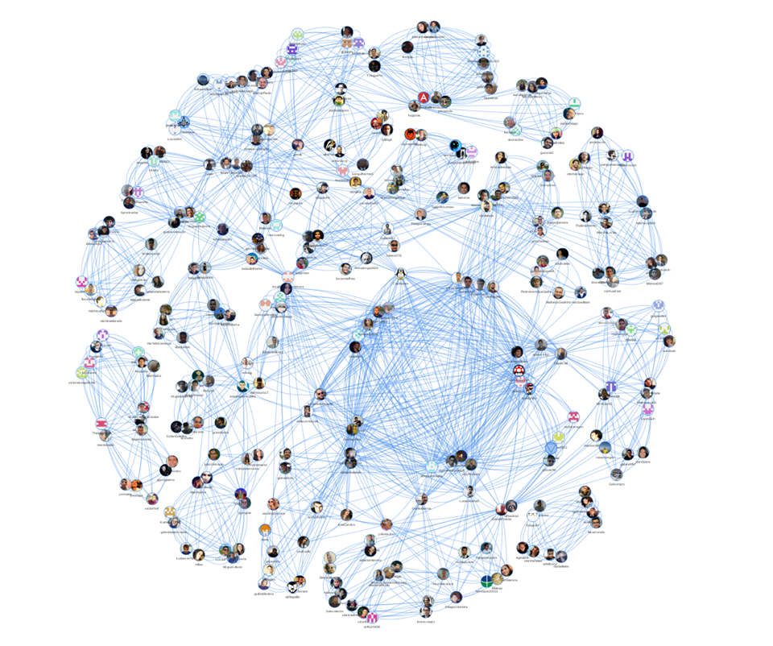

A maioria das empresas de tecnologia trabalhava com uma abordagem mais tradicional e sequencial, conhecida como "cascata". Essa abordagem envolve uma fase de planejamento detalhado, seguida por uma fase de design, depois uma fase de implementação e, finalmente, uma fase de testes.

No entanto, com a crescente complexidade dos projetos de software, muitas empresas perceberam que essa abordagem era muito rígida e inflexível. Surgiu então a metodologia ágil, que se concentra em colaboração, iteração e flexibilidade.

Para acelerar o aprendizado e disseminar a cultura de inovação ágil, é importante invistir em treinamento e desenvolvimento de engenheiro de software. Isso pode incluir cursos de treinamento específicos sobre metodologias ágeis, como Scrum e Kanban, bem como a criação de equipes multidisciplinares e grupos de discussão para compartilhar ideias e práticas.

Além disso, os cursos de tecnologias devem incentivar seus funcionários a experimentar novas ideias e abordagens. Isso pode envolver a criação de um ambiente seguro para tentativas e erros, bem como a celebração dos sucessos e aprendizados.

Outra maneira de acelerar o aprendizado e disseminar a cultura de inovação ágil é por meio da implementação de ferramentas e tecnologias que suportem o processo de desenvolvimento ágil. Isso pode incluir ferramentas de gerenciamento de projetos, ferramentas de colaboração e comunicação, bem como plataformas de automação e integração contínua.

Em resumo, para acelerar o aprendizado e disseminar a cultura de inovação ágil, disciplinas de cursos de TI devem investir em treinamento e desenvolvimento, incentivar a experimentação e implementar ferramentas e tecnologias que suportem o processo de desenvolvimento ágil. Com essas medidas, as empresas podem criar equipes mais produtivas e inovadoras, capazes de lidar com os desafios da indústria de tecnologia em constante evolução.

## O que você encontrará aqui

Este livro está dividido em duas partes distintas. Na primeira, você encontrará os principais conceitos relacionados à metodologia ágil de maneira prática e aplicável. Além disso, são apresentados checklists que visam auxiliar na adoção sistemática das práticas e cultura ágil. Já na segunda parte, é apresentada uma metodologia desenvolvida e amadurecida para o ensino de métodos ágeis. Essa metodologia de ensino é baseada em fundamentos como aprendizagem baseada em experiência, processo de Onboarding, Padrões e práticas de comunidades de Software Livre, bem como um ciclo de desenvolvimento de projeto de software.

Além de permitir que o leitor escolha a ordem de leitura das duas partes do livro, são disponibilizadas referências para aprofundamento em cada conceito ou assunto. A metodologia apresentada pode ser aplicada não só para a introdução aos métodos ágeis, mas também para guiar no processo de contribuição em comunidades de software livre, introdução à Engenharia de Produto, Gerenciamento, Configuração e Evolução de Software. Assim, essa abordagem pode ser adaptada e utilizada em diferentes contextos, dependendo das necessidades do leitor.

## Como surgiu o livro que você tem em mãos

Inicialmente, é importante discutir os elementos que, em minha opinião, são fundamentais para compor a estrutura de um curso eficiente, independentemente de ser presencial ou online. Acredito que a aprendizagem dos alunos é mais significativa quando eles experimentam as seguintes condições:

- **Ativa participação**: os estudantes são incentivados a participar ativamente das atividades, discussões e projetos propostos pelo curso, o que os torna protagonistas do processo de aprendizagem;
- **Responsabilidade pela própria aprendizagem**: é fundamental que os alunos sejam encorajados a assumir a responsabilidade por seu próprio aprendizado, o que os estimula a buscar o conhecimento e a resolver problemas de forma autônoma;
- **Controle significativo sobre a experiência**: os alunos devem ter um papel ativo na construção de sua própria experiência de aprendizagem, podendo escolher entre diferentes abordagens e metodologias, de acordo com suas necessidades e interesses.

Essas condições são essenciais para que os alunos se sintam motivados e engajados, desenvolvam habilidades e competências relevantes e, consequentemente, alcancem melhores resultados em seu processo de aprendizagem.

Para alcançar esses objetivos, é fundamental que nós, como educadores, atuemos como facilitadores da aprendizagem, orientando a experiência de forma cuidadosa e respeitando a autonomia dos alunos. Nesse sentido, é importante adotar uma postura mais flexível e adaptativa, permitindo que os estudantes tenham a liberdade de explorar, experimentar e descobrir, com o apoio e a supervisão necessários. Desse modo, poderemos oferecer um ensino mais personalizado, que atenda às necessidades individuais dos alunos e promova o desenvolvimento de habilidades e competências relevantes para o seu futuro.

A metodologia apresentada nesse livro já foi aplicada com sucesso em diversas disciplinas de Engenharia de Software da Universidade de Brasília (UnB), bem como em programas de mentoria e residência TIC. Um exemplo bem-sucedido é o programa de mentoria Big Open Source Siblings - BOSS ([https://github.com/BOSS-BigOpenSourceSister/BigSister](https://github.com/BOSS-BigOpenSourceSister/BigSister)), cuja metodologia foi premiada pelo GNOME Community Engagement Challenge ([https://www.gnome.org/challenge/](https://www.gnome.org/challenge/)). Em um concurso que contou com a participação de 150 projetos, o BOSS conquistou o primeiro lugar, comprovando a eficácia da metodologia na promoção de uma aprendizagem significativa e colaborativa. Além disso, a metodologia já foi experiênciada por mais de 500 alunos de graduação do curso de Engenharia de Software da Universidade de Brasília ([https://github.com/fga-eps-mds](https://github.com/fga-eps-mds)). A imagem abaixo ilustra um dos principais aspectos da metodologia adotada na disciplina de Métodos de Desenvolvimento de Software até o ano de 2018: a cultura de aprendizagem colaborativa. Cada nó no grafo representa um aluno que participou da disciplina, enquanto as arestas representam as colaborações estabelecidas entre dois ou mais alunos para a realização de tarefas. Através dessa abordagem, os alunos puderam não só desenvolver habilidades técnicas, mas também aprimorar suas habilidades de trabalho em equipe e colaboração, essenciais para o sucesso em ambientes profissionais e acadêmicos. 

Esses resultados evidenciam a importância de uma abordagem mais personalizada e flexível na educação, que valorize o protagonismo dos alunos e sua participação ativa na construção do conhecimento. Além disso, mostram que é possível inovar e reinventar práticas pedagógicas, por meio do uso criativo de tecnologias e metodologias de ensino.

## Licença

Copyright 2023 Carla Rocha.
